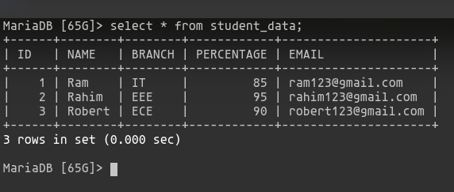
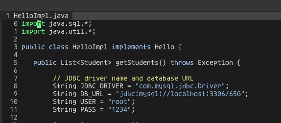
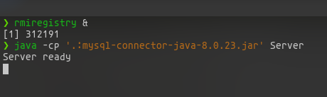
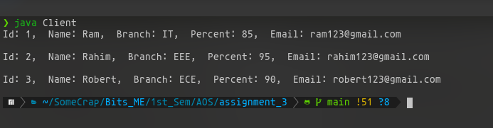

# README

Steps to run the RMI Database application.

1. Run the sql script to create table and enter data.

    ```bash
    # open terminal and cd into the project folder and run this.
    $ mysql -u root -p < ./createStudent_data.sql
    ```

    This will create a new database named '65G' and inside it, a table student_data with the data provided in the problem set. The resultant table :

    

2. Before compilation, we need to set the databse username and password correctly. Open [HelloImpl.java](http://helloimpl.java) 

    

    Make sure the variable USER and PASS are correct according to your database.
    In the DB_URL 'jdbc:mysql://localhost:3306/65G', '65G' refers to the name of the database created in the initial sql script we ran. If you are using a previous database replace '65G' with the name of that database

3. Compile all the files

    ```bash
    $ javac *.java
    ```

4. Start the rmi registry 

    ```bash
    $ rmiregistry &
    ```

    This will start rmiregistry as a background process.

5. Start the server with the provided sqlconnector jar. We need jdbc driver class for the server to run. So we provide it in the classpath. 

    ```bash
    $ java -cp '.:mysql-connector-java-8.0.23.jar' Server
    ```

    You will see a comment saying 'Server Started', 

    

6. Open a new terminal window and run the Client

    ```bash
    $ java Client
    ```

    This will list the data present in the table student_data, 

    
